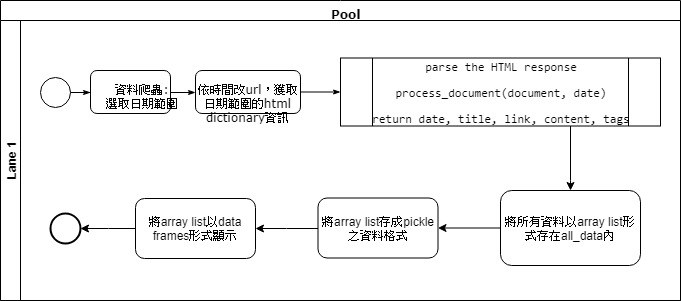

# FinTech PreCourse - 2019 Spring

## Overview

The modified code is "mycrawler.py"

### Level 1: Flowchart from TA's code (origin_crawler.py)


### Level 2: Execute TA's code and add annotation
Already annotated in origin_crawler.py

For ubuntu users:
```bash
$ python3 origin_crawler.py
```

For Windows users:
```bash
$ python origin_crawler.py
```

### Level 3: Modify code
As mycrawler.py shows.
Import the modified module

## Packages
- Crawler: **_requests_** and **_BeaufifulSoup4_**
- Text mining: **_pandas_**
- Parser library: **_lxml_**